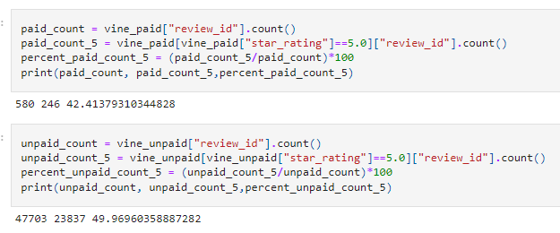

# Amazon_Vine_Analysis

## Table of Contents
- [Overview of Project](#OverviewProject)
- [Results](#Results)
- [Summary](#Summary)
- [Resources](#Resources)

## Overview of Project

We were tasked in analyzing customer reviews in the Amazon website, from a product of our liking [[1]](#1). We picked the cameras reviews. We first uploaded and cleaned the data into out AWS RDS - SQL data base  [[2]](#2). Then we extraced some of the data resulting from out data bases (the Vine Table [[4]](#4)) and used Pandas, to analyze if the Amazon Vine program creates a bias towards better reviews [[3]](#3).

## Results

In our analysis we found the following results: 

### Paid Vine program members reviews:
- Number of reviews: 580 reviews
- Number of 5-star reviews: 246 reviews
- Percentage of 5-star reviews: 42.4%

### Non-Vine reviews: 
- Number of reviews: 47,703 reviews
- Number of 5-star reviews: 23,849 reviews
- Percentage of 5-star reviews: 49.97%

### Overall Results 
- Total Number of reviews: 48,283 reviews
- Total Number of 5-star reviews: 24,095 reviews
- Percentage of 5-star reviews: 49.90%
- Percentage of Vine Member Reviews: 1.20%
- Percentage of Non-Vine Reviews: 98.80%

  

 Figure 1: Vine Program Reults
 

##  Summary

This analysis considers 1 out of 50 data sets of reviews for different product categories. Certainly, the results we found can not make an overall claim on a potential bias of positive reviews for Vine program members. To make a more conclusive claim, we would have to perform the same analysis we did in all 50 data sets. We could additionally, find the mean review score for Vine program members vs Non-Vine reviews, as these numbers would indicate if there's a tendency for positive or negative reviews, considering numbers like 4-stars or 3-starts (overall positive reviews).

According to our findings, Non-Vine camera reviewers had 49.97% 5-star reviews, and consisted of 98.80% of all camera reviews considered. Vine program members on the other hand, had 42.4% 5-star reviews and consisted of only 1.20% of all the reviews considered. For cameras, we do not see Vine program members having a vias towards positive reviews. Yet, it is worth mentioning that now a days almost everyone has access to a camera on their phone. So customers for non-phone cameras are purchasing them with a specific purpose in mind, whether it is a go pro for underwater use or a professional camera that allows for better quality and more control of the settings used. Non-phone cameras are usually bought for a hobby, passion or professional use. Needless to say, these are enthusiastic customers. Vine program members receiving a camera might not share the same enthusiasm for its potential use. Additionally, they represent a very small percentage of the overall reviews. 

## Resources

<a name="1">[1]</a> [Amazona Reviews - we picked camera](https://s3.amazonaws.com/amazon-reviews-pds/tsv/index.txt)

<a name="2">[2]</a> [Code - Amazon Camera Reviews Data Base Set Up](https://github.com/tamiespinosa/Amazon_Vine_Analysis/blob/4da507d96a83990c9a758a4ec92a7e7c90434aff/Amazon_Reviews_ETL.ipynb)

<a name="3">[3]</a> [code - Vine Table Analysis](https://github.com/tamiespinosa/Amazon_Vine_Analysis/blob/4da507d96a83990c9a758a4ec92a7e7c90434aff/Vine_Review_Analysis.ipynb)

<a name="4">[4]</a> [Vine Data](https://github.com/tamiespinosa/Amazon_Vine_Analysis/blob/4da507d96a83990c9a758a4ec92a7e7c90434aff/Resources/vine_table.csv)

[5] https://docs.github.com/en/get-started/writing-on-github/getting-started-with-writing-and-formatting-on-github/basic-writing-and-formatting-syntax
